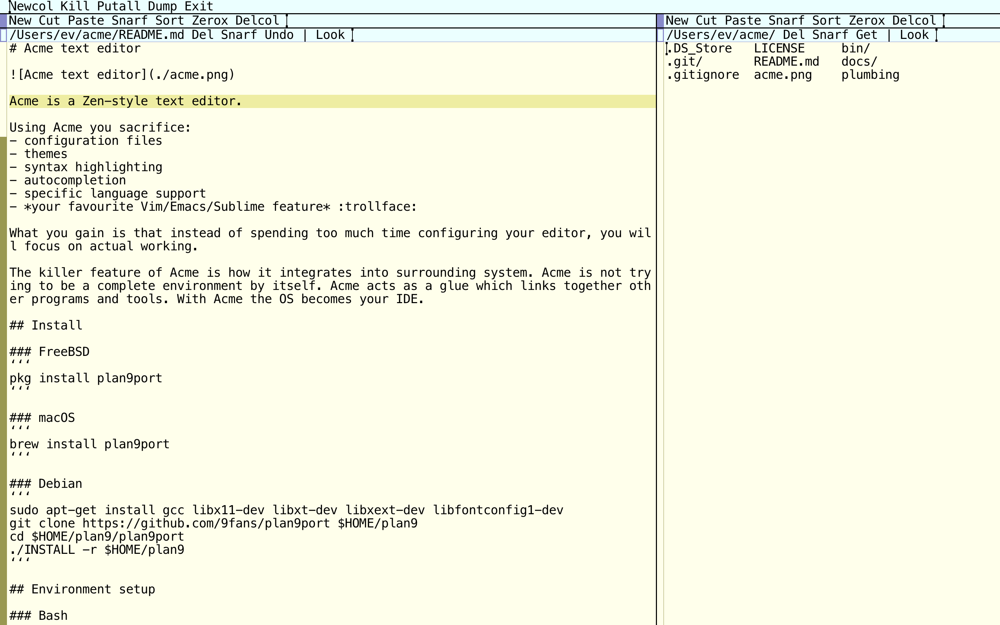

# My Acme Text Editor Setup



Acme is a Zen-style text editor.

Using Acme you sacrifice:
- configuration files
- themes
- syntax highlighting
- autocompletion
- specific language support
- *your favourite Vim/Emacs/Sublime feature* :trollface:

What you gain is that instead of spending too much time configuring your editor, you will focus on actual working.

The killer feature of Acme is how it integrates into surrounding system. Acme is not trying to be a complete environment by itself. Acme acts as a glue which links together other programs and tools. With Acme the OS becomes your IDE.

## Install

### macOS
```
mkdir -p $HOME/apps && cd $HOME/apps
git clone https://github.com/9fans/plan9port/ && cd plan9port
./INSTALL
```

## Run

I run Acme by running the `a` script.